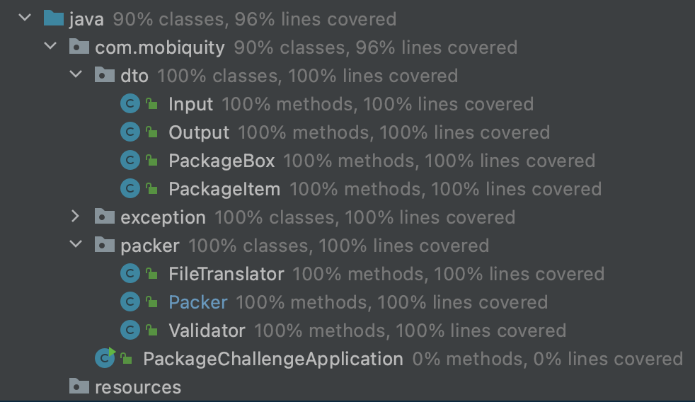
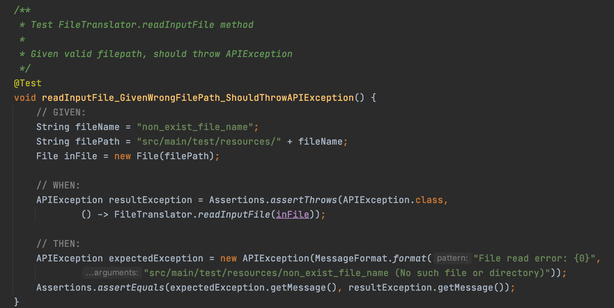
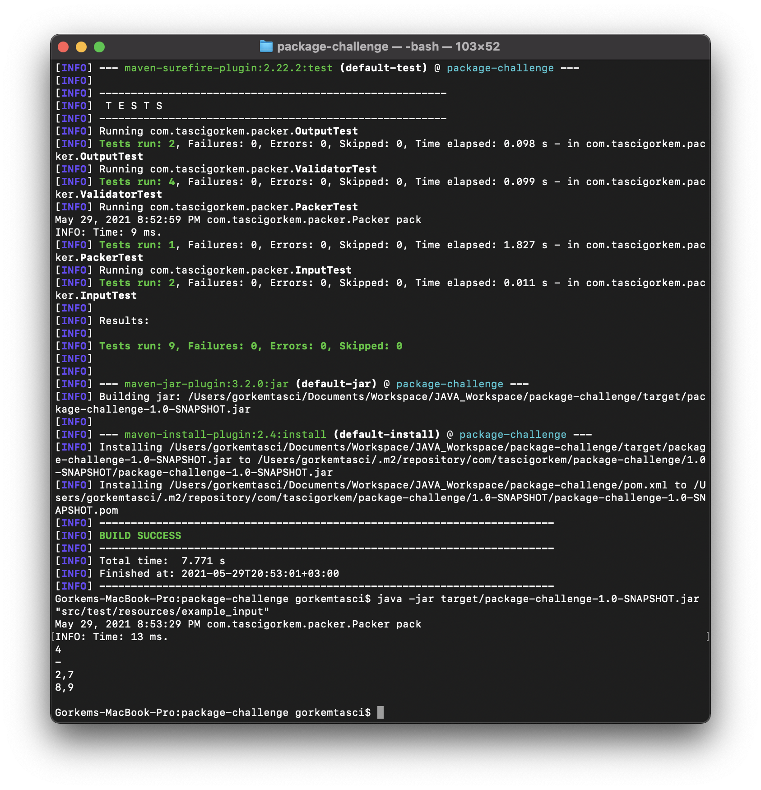

## Package Challenge

It's a maven project for solving packaging problem.

## Problem:

You want to send your friend a package with different things.

Each thing you put inside the package has such parameters as index number, weight and cost. The
package has a weight limit. Your goal is to determine which things to put into the package so that the
total weight is less than or equal to the package limit and the total cost is as large as possible.

You would prefer to send a package which weighs less in case there is more than one package with the
same price. 

#### Input sample

Each line contains the weight that the package can take (before the colon) and the list of items you need
to choose. Each item is enclosed in parentheses where the 1st number is a item’s index number, the 2nd
is its weight and the 3rd is its cost. E.g.

`81 : (1,53.38,€45) (2,88.62,€98) (3,78.48,€3) (4,72.30,€76) (5,30.18,€9) (6,46.34,€48)`

`8 : (1,15.3,€34)`

`75 : (1,85.31,€29) (2,14.55,€74) (3,3.98,€16) (4,26.24,€55) (5,63.69,€52) (6,76.25,€75) (7,60.02,€74) (8,93.18,€35) (9,89.95,€78)`

`56 : (1,90.72,€13) (2,33.80,€40) (3,43.15,€10) (4,37.97,€16) (5,46.81,€36) (6,48.77,€79) (7,81.80,€45) (8,19.36,€79) (9,6.76,€64)`

#### Output sample

For each set of items that you put into a package provide a new row in the output string (items’ index
numbers are separated by comma). E.g.

`4`

`-`

`2,7`

`8,9`

#### Constraints

1. Max weight that a package can take is ≤ 100
2. There might be up to 15 items you need to choose from
3. Max weight and cost of an item is ≤ 100

## Solution

First, It could be solved using brute force i.e. checking each possibility. 
Then the time complexity would be O(2^n). It is not good enough.

Instead of this, 0-1 Knapsack implementation with dynamic programming is used. 
So, algorithm has a running time of O(n*W). 
n is a number of items in package and W is a maximum weight limit.

1- Construct 2D cost matrix for weights [itemSize+1][weightLimit+1]

2- Fill the 2D cost matrix with dynamic programming according to;

if w[i] > maxWeight
then F(i, maxWeight) = F(i-1, maxWeight)

else if w[i] < maxWeight
then F(i, maxWeight) = max{ F(i-1, maxWeight), F(i-1, maxWeight-w[i]) + v[i] }

3- Iterate 2D cost matrix to find out selected item indexes

### Tests

JUnit5, Mockito are used in this project.

`maven-surefire-plugin` plugin is added into `pom.xml`.

Then, run `mvn test` command for Unit Tests (**/*Test.java)

Used patterns:

* TDD (Test Driven Development)

* GWT (Given When Then)

**Code Coverage:** 100%

**Validation & Exception Handling:**

### Javadoc

Used javadoc standards for method descriptions.

`maven-surefire-plugin` plugin is added into `pom.xml`.

Then `mvn javadoc:javadoc` for create javadocs.

Javadoc directory: `../package-challenge/target/site/apidocs/`

### Notes

- **Lombok** is used for autogenerate boilerplate zero-value codes.

- Valid input file `example_input` and response file `example_output` are in `../src/test/resources/` directory.

- Other invalid input files are also in same directory

### To Run

To run this application; 

`mvn clean install`

`java -jar target/implementation-1.0-SNAPSHOT.jar "src/test/resources/example_input"`

